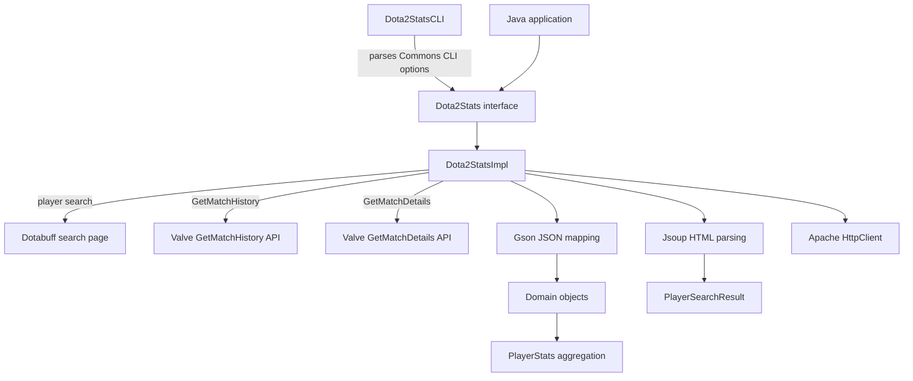

# Architecture

The repository is a single Maven Java project. It contains:

- a public wrapper interface in `de.inkvine.dota2stats`;
- an implementation in `de.inkvine.dota2stats.impl`;
- domain interfaces and implementation classes under `de.inkvine.dota2stats.domain`;
- a command-line front end in `de.inkvine.dota2stats.commandline`;
- a custom checked exception, `Dota2StatsAccessException`, for access failures.

## Package layout

```text
src/main/java/de/inkvine/dota2stats/
├── Dota2Stats.java
├── commandline/
│   └── Dota2StatsCLI.java
├── domain/
│   ├── filter/
│   ├── matchdetail/
│   ├── matchhistory/
│   ├── playersearch/
│   └── playerstats/
├── exceptions/
│   └── Dota2StatsAccessException.java
└── impl/
    └── Dota2StatsImpl.java
```

## Runtime flow



## Key components

### `Dota2Stats`

`Dota2Stats` is the public interface. It exposes methods for player search, match history, match details, and player stat aggregation.

### `Dota2StatsImpl`

`Dota2StatsImpl` builds request URLs, performs HTTP GET requests, parses responses, and constructs domain objects.

Important constants in the implementation:

| Constant | Purpose |
| --- | --- |
| `API_GET_MATCH_HISTORY_URL` | Valve `GetMatchHistory` endpoint. |
| `API_GET_MATCH_DETAILS_URL` | Valve `GetMatchDetails` endpoint. |
| `API_DOTABUFF_SEARCH_PLAYER` | Dotabuff player search URL. |
| `MAXIMUM_NUMBER_OF_MATCH_OVERVIEWS_PER_REQUEST` | Set to `100` for paging aggregated stat requests. |

### Filters and query strings

`MatchHistoryFilter` stores selected query criteria. `QueryStringBuilder` converts those criteria into `&name=value` query parameters appended to the Valve match-history URL.

### Aggregated stats

`getStats` first requests match history for an account, pages through more match overviews when needed, then requests match details for the selected matches. Detail requests are submitted to a fixed thread pool of 25 tasks. The implementation totals kills, deaths, assists, last hits, denies, GPM, and XPM for the requested account and returns a `PlayerStatsImpl`.

!!! warning
    Aggregated stats can produce many external requests because every selected match needs match-detail data.
